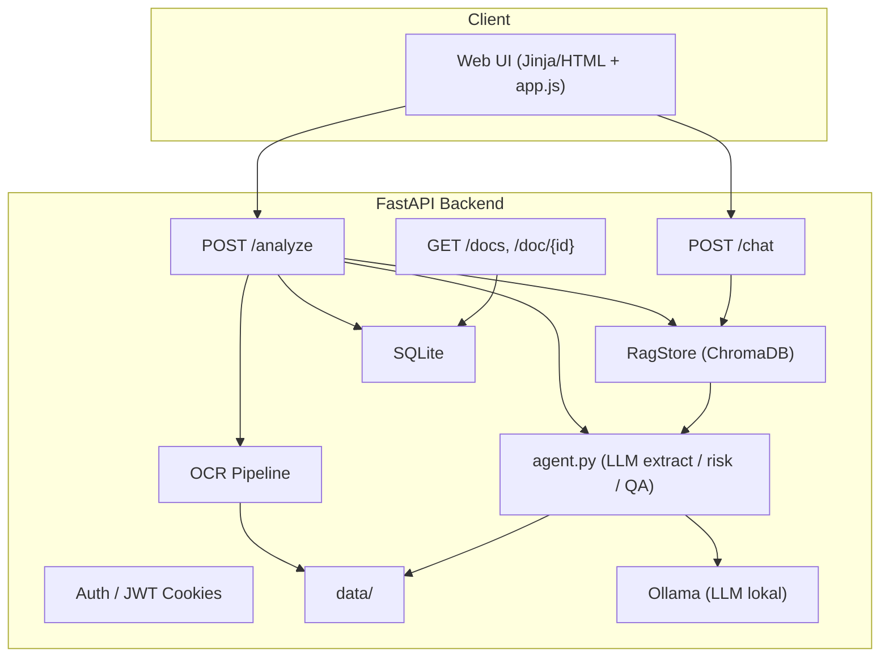

---

# Agentic Credit (Multi-User) — PDF Credit Analysis & QA

Sistem end-to-end untuk **analisis dokumen kredit** (PDF native/scan), **ekstraksi JSON terstruktur**, **ringkasan risiko**, dan **Q\&A berbasis isi dokumen** dengan **RAG** (ChromaDB) + **LLM lokal** (Ollama).
Mendukung **multi-user** (isolasi dokumen), **OCR otomatis** (native/scan/hybrid), dan **UI web bawaan** (Jinja + HttpOnly cookie).

---

## ✨ Ringkasan Fitur

* **Upload & Analisis**: OCR otomatis, ekstraksi entitas ke **JSON**, ringkasan risiko (JSON), dan rasio turunan (DSCR, ICR, FCCR, Current/Quick, DER, EBITDA Margin).
* **RAG kuat**: indeks per halaman + **injeksi hasil ekstraksi (JSON/risk)** ke vector store (label `kind=table|json|risk`, sitasi `p.EXTRACT`).
* **Q\&A Reasoning**: LLM menjawab **berdasarkan konteks** (OCR + tabel + JSON ekstraksi), tidak mengasumsikan selalu soal fasilitas kredit.
* **Fast Answer (opsional)**: mode heuristik untuk pertanyaan numerik/pendek (limit/tenor/bunga) → jawaban cepat dari JSON; bisa dimatikan.
* **Multi-user**: isolasi `user_id`+`doc_id` di SQLite & Chroma; endpoint `/docs`, `/doc/:id` berfilter user.
* **UI Web Bawaan**: login (JWT via HttpOnly cookie), upload, preview halaman PDF, hasil analisis, dan chat QA.
* **Telemetry Off**: variabel lingkungan mematikan telemetry Chroma/Posthog.

---

## 🧭 Arsitektur



### Alur Analyze (end-to-end)

1. **Deteksi PDF** → OCR **native/scan/hybrid** per halaman.
2. Index teks per halaman ke **Chroma** (`metadatas: doc_id, user_id, page`).
3. Ekstraksi **tabel** → ringkasan tabel ke **Chroma** (`kind=table`).
4. **LLM** (lokal, Ollama) mengekstrak **JSON terstruktur** dan **risk\_summary**.
5. **PATCH terbaru**: dorong **JSON** (`kind=json`, `p.EXTRACT`) & **risk** (`kind=risk`, `p.EXTRACT`) ke Chroma.
6. Simpan **report** ke `data/reports/{doc_id}.json` (berisi `user_id`, `pages`, `json_struct`, `risk_summary`, `table_chunks`).
7. Tulis metadata dokumen ke **SQLite**.

### Alur Chat (QA)

1. Query **Chroma** (filter `user_id` & `doc_id`) → ambil top-k konteks.
2. **Inject** JSON ekstraksi di posisi **paling awal** konteks.
3. LLM QA menjawab **hanya** dari konteks (OCR + tabel + JSON ekstraksi).
   Jika info tidak ada → “Tidak tersedia dalam dokumen.”
4. Sitasi mengikuti metadata halaman, termasuk **`p.EXTRACT`** untuk hasil JSON/risk.

---

## 🧠 LLM & Reasoning

* **Ollama (lokal)**, default: `llama3.1:8b-instruct-q8_0`.
* Ekstraksi & ringkasan memakai `options.format="json"` → hasil JSON disiplin + **parser aman** sebagai fallback.
* **Prompts terbaru** (`prompts.py`):

  * QA menekankan **deteksi maksud pertanyaan** secara umum (tidak melulu fasilitas).
  * Sitasi **konsisten**: `(p.<hal>)` atau `(p.EXTRACT)`.
  * “Jawab hanya dari konteks; jika tidak ada, nyatakan tidak tersedia.”

### Fast Answer (opsional)

* Toggle via env `FAST_ANSWER_MODE`: `off | strict | smart`.
* Jika `off` → **semua** pertanyaan lewat LLM QA (penalaran penuh).
* `strict/smart` → hanya pertanyaan pendek & numerik (limit/tenor/bunga/total) yang **eligible** dijawab cepat dari JSON.
  Kalau tidak yakin, jatuh ke LLM QA.

---

## 🔐 Multi-User & Keamanan

* Login via `/auth/login` → token diset sebagai **HttpOnly cookie** (`ac_token`) + CSRF dummy (`ac_csrf`).
* Semua rute UI (`/ui/...`) **mem-proxy** ke API dengan header Authorization dari cookie.
* Chroma **selalu** difilter `{"$and":[{"doc_id":..},{"user_id":..}]}`.
* `/doc/:id` memverifikasi **kepemilikan** (`user_id`) sebelum mengembalikan hasil.

---

## 📁 Struktur Proyek

```
backend/
  main.py              # FastAPI + UI proxy + endpoints
  agent.py             # LLM extract+risk+QA (Fast-Answer toggle, sitasi p.EXTRACT)
  rag.py               # Chroma wrapper (add_pages, query with filters)
  ocr_pipeline.py      # OCR native/scan/hybrid, render page png
  table_extract.py     # ekstraksi tabel + normalisasi (opsional fleksibel/simulasi)
  prompts.py           # sistem prompt (QA & Extract) terbaru
  models.py, auth.py, utils.py, db_bootstrap.py
templates/
  app.html, login.html, partials/*.html
static/
  app.js, style.css
data/
  input/, images/, ocr/, reports/
vectordb/              # Chroma persistent store
db/
  app.db               # SQLite
```

---

## ⚙️ Konfigurasi (`.env`)

```ini
# App
APP_HOST=0.0.0.0
APP_PORT=8000
PUBLIC_BASE_URL=  # opsional; jika di-set, UI proxy akan mengarah ke URL ini

# Ollama (LLM lokal)
OLLAMA_HOST=http://127.0.0.1:11434
OLLAMA_MODEL=llama3.1:8b-instruct-q8_0
OLLAMA_NUM_CTX=8192
OLLAMA_NUM_THREAD=8
OLLAMA_NUM_PREDICT=1024
OLLAMA_TEMP_EXTRACT=0.10
OLLAMA_TEMP_QA=0.30
OLLAMA_TOP_P_QA=0.90

# Fast Answer
FAST_ANSWER_MODE=off   # off | strict | smart

# Telemetry off (Chroma/Posthog)
ANONYMIZED_TELEMETRY=False
CHROMADB_TELEMETRY=False
CHROMA_TELEMETRY_DISABLED=1
```

---

## 📦 Instalasi

### 1) Prasyarat

* Python 3.10+
* **Tesseract** + **poppler** (render PDF → image)
* **Ollama** terpasang & model ditarik:

  ```bash
  ollama pull llama3.1:8b-instruct-q8_0
  ```
* (Opsional) GPU NVidia untuk akselerasi Ollama.

### 2) Setup cepat

```bash
# di root repo
python -m venv .venv
source .venv/bin/activate
pip install -r requirements.txt

# bootstrap DB
python -m backend.db_bootstrap

# jalankan backend
uvicorn backend.main:app --host 0.0.0.0 --port 8000 --reload
```

> Catatan: Saat pertama kali, **Chroma** mungkin mengunduh model ONNX embedding (`all-MiniLM-L6-v2`, \~79MB) ke cache `~/.cache/chroma`. Satu kali saja; berikutnya pakai cache.

---

## 🖥️ Menjalankan UI

* Buka `http://localhost:8000/` → **Login** → **Upload PDF** → lihat hasil → **Chat**.
* UI memakai **HttpOnly cookie**; JS front-end (`app.js`) memanggil rute `/ui/*` yang mem-proxy ke API.

---

## 🔌 Endpoint Utama (API)

* `POST /auth/login` → `{ access_token }`
* `POST /analyze` (multipart `file`) → `{ doc_id, pages, json_struct, risk_summary }`
* `POST /chat` `{ doc_id, question, history }` → `{ answer, sources }`
* `GET /docs` → daftar dokumen user
* `GET /doc/:id` → report JSON (validasi kepemilikan)
* `GET /doc/:id/page/:n` → preview PNG base64
* `GET /health` → `{ status: "ok" }`

---

## 🧪 Perilaku Penting (sesuai patch terbaru)

* **Injeksi JSON & Risk ke RAG**
  Setelah ekstraksi, backend mendorong:

  * `kind=json`, `page="EXTRACT"` → isi `json_struct`
  * `kind=risk`, `page="EXTRACT"` → isi `risk_summary`
    Sehingga QA dapat mengutip `(p.EXTRACT)` untuk poin dari ekstraksi.

* **QA Reasoning luas**
  Prompt QA tidak mengasumsikan pertanyaan selalu soal fasilitas; dia **mendeteksi maksud** (profil, manajemen, tujuan, finansial, dsb.) dan menjawab dari konteks relevan.

* **Fast-Answer (opsional)**
  Jika `FAST_ANSWER_MODE!=off`, pertanyaan numerik/pendek tertentu dijawab cepat dari JSON. Jika tidak yakin, jatuh ke QA LLM.

---

## 🧰 Tuning & Tips

* **RAG**: `n_results=5`–`8`; pastikan `page` terisi supaya sitasi `(p.N)` muncul.
* **Chunking tabel**: `kind=table` membantu QA menemukan angka.
* **NUM\_PREDICT**: 800–1200 cukup untuk jawaban singkat namun informatif.
* **Temperatur**: rendah (0.1–0.3) untuk konsistensi, khusus QA.
* **Cache Chroma**: mount volume cache di Docker (`~/.cache/chroma`) agar **sekali unduh**.

---

## 🧩 Roadmap

* Re-ranking (cross-encoder) setelah embedding untuk presisi konteks lebih tinggi.
* Ekstraksi tabel finansial **native PDF** (pdfplumber/camelot) untuk akurasi angka.
* Validasi skema hasil JSON (Pydantic) + versioning.
* Redaksi otomatis identitas sensitif (NPWP/NIK) dalam report.

---

## 📜 Lisensi

MDI 2025

---
