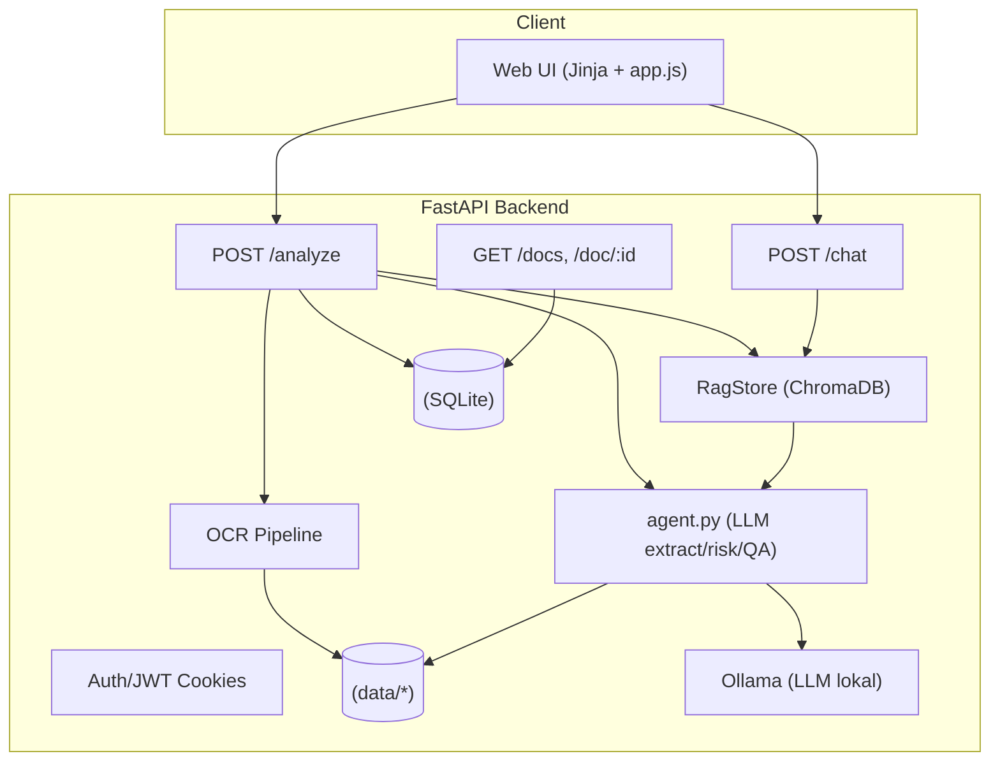
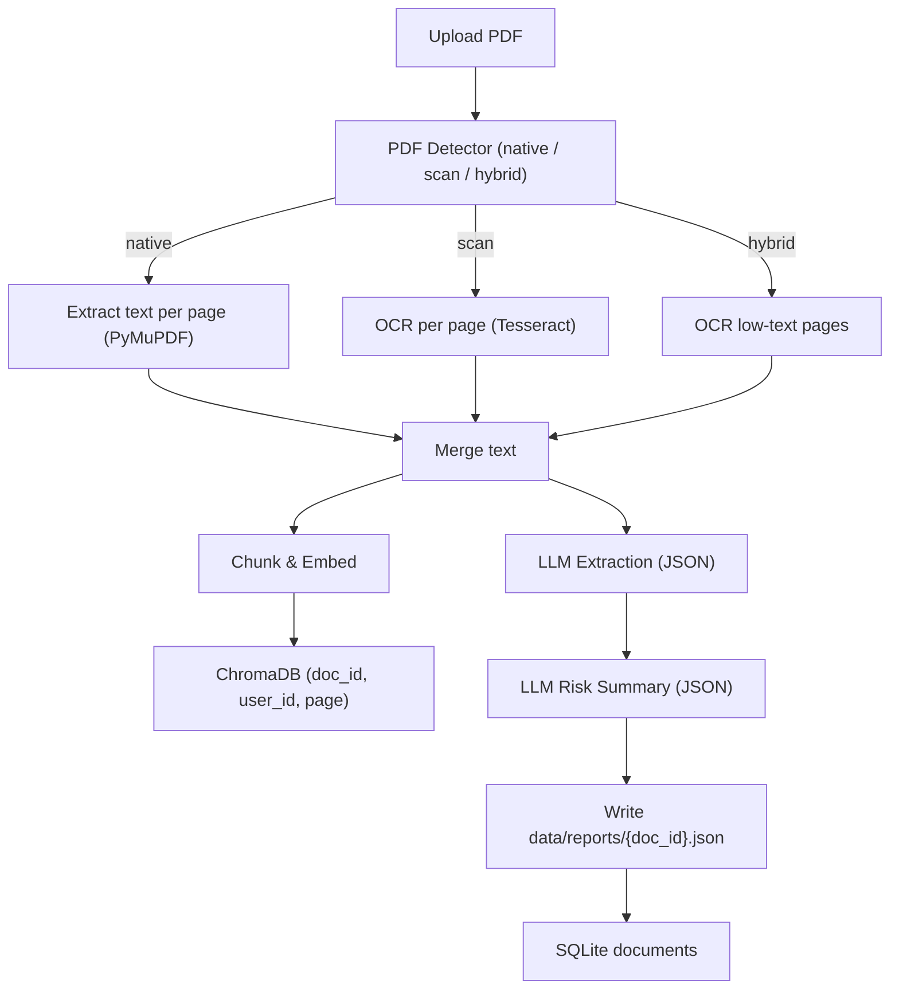
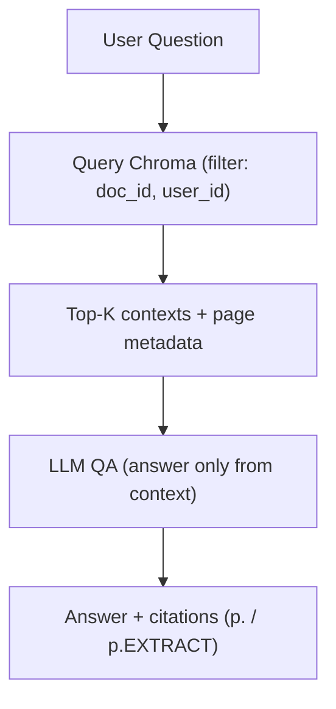
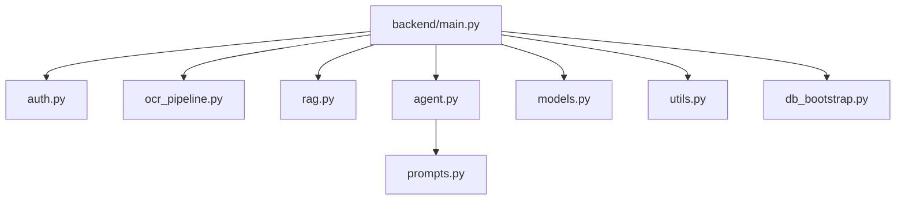
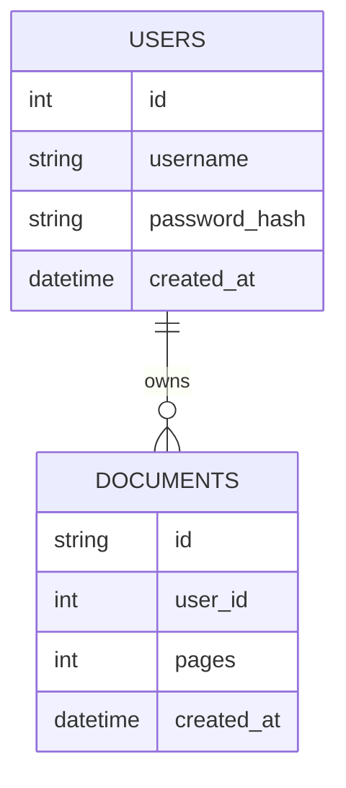

# Agentic Credit (Multi-User) — PDF Credit Analysis & QA

End-to-end app untuk **analisis dokumen kredit PDF** (native/scan) dan **tanya-jawab berbasis isi dokumen** memakai **RAG + LLM**.
Fitur: **multi-user** dengan isolasi dokumen, **OCR otomatis**, **RAG** (ChromaDB), dan **LLM lokal** via **Ollama**.

---

## ✨ Fitur Utama

* **Upload & Analisis**: Ekstraksi entitas kredit → JSON; ringkasan risiko; rasio (DSCR, ICR, FCCR, Current/Quick Ratio, DER, EBITDA Margin).
* **Tanya-Jawab (QA)**: Jawab **hanya** dari konteks dokumen (RAG) dengan **sitasi halaman** `(p.N)` atau `p.EXTRACT`.
* **Multi-User**: Login JWT; vektor dan dokumen **terisolasi per user**.
* **OCR Otomatis (Hybrid)**: OCR hanya halaman yang perlu (cepat & hemat).
* **Telemetry Off**: Chroma/PostHog dimatikan dari kode.

---

## 🧭 Arsitektur (Ringkas)



---

## 🔎 Alur Analyze



## 💬 Alur Chat (QA)



## 🧩 Peta Modul



## 🗄️ ERD (Data Model)



---

## ⚙️ Konfigurasi

Buat file `.env` (contoh):

```ini
# Ollama (LLM lokal)
OLLAMA_HOST=http://127.0.0.1:11434
OLLAMA_MODEL=llama3.1:8b-instruct-q8_0
OLLAMA_NUM_CTX=8192
OLLAMA_NUM_THREAD=8
OLLAMA_NUM_PREDICT=1024
OLLAMA_TEMP_EXTRACT=0.10
OLLAMA_TEMP_QA=0.30
OLLAMA_TOP_P_QA=0.90

# Fast-answer toggle (opsional): off | strict | smart
FAST_ANSWER_MODE=smart

# App
APP_HOST=0.0.0.0
APP_PORT=8000

# Matikan telemetry
ANONYMIZED_TELEMETRY=False
CHROMA_TELEMETRY_DISABLED=1
```

> **Catatan embedding/Chroma**
> Saat pertama kali jalan, Chroma akan **mengunduh** model embedding ONNX (`all-MiniLM-L6-v2`) ke cache lokal (`~/.cache/chroma/...`). Ini **sekali saja**; berikutnya offline.

---

## 🛠️ Instalasi & Jalankan

### Prasyarat

* Python 3.10+
* Tesseract OCR (`sudo apt-get install tesseract-ocr`)
* Ollama terpasang & model ditarik:
  `curl -fsSL https://ollama.com/install.sh | sh` kemudian `ollama pull llama3.1:8b-instruct-q8_0`

### Cepat (script)

```bash
bash install_agentic_credit.sh
```

### Manual

```bash
python -m venv venv
source venv/bin/activate           # Windows: venv\Scripts\activate
pip install -r requirements.txt

# Jalankan backend
uvicorn backend.main:app --host 0.0.0.0 --port 8000 --reload
# Akses UI: http://localhost:8000 (login lalu ke /app)
```

Struktur data:

```
data/
  input/     # PDF
  images/    # render halaman (PNG)
  ocr/       # hasil OCR per halaman
  reports/   # {doc_id}.json (json_struct + risk_summary + table_chunks)
vectordb/    # ChromaDB (persistent)
db/          # SQLite app.db
```

---

## 🧠 Prompting (prompts.py)

```python
QA_SYSTEM_PROMPT = (
    "Anda analis kredit korporasi berpengalaman 20 tahun.\n"
    "Pahami maksud pertanyaan (tidak selalu tentang fasilitas kredit).\n"
    "Jawab HANYA berdasarkan konteks (OCR/RAG, tabel terstruktur, JSON ekstraksi) yang diberikan.\n"
    "Jika informasi tidak ada di konteks, jawab: 'Tidak tersedia dalam dokumen.'\n"
    "Gunakan sitasi konsisten (format: p.<hal> atau p.EXTRACT) untuk setiap angka/nama penting.\n"
    "Gunakan bahasa yang sama dengan pertanyaan (ID/EN), ringkas dan profesional.\n"
)
```

* `agent.py` sudah memakai opsi `format="json"` untuk ekstraksi & ringkasan risiko agar output disiplin JSON.
* Fast-answer (bila diaktifkan) hanya menjawab cepat untuk pertanyaan pendek & numerik; selebihnya selalu lewat penalaran LLM penuh.

---

## 🔌 API Ringkas

* `POST /auth/login` → `{ "access_token": "..." }`
* `GET /docs` → daftar dokumen user saat ini
* `POST /analyze` (multipart `file=...pdf`) → `{ doc_id, pages, json_struct, risk_summary }`
* `POST /chat` `{ doc_id, question, history }` → `{ answer, sources }`
* `GET /doc/{doc_id}` → JSON report yang tersimpan
* `GET /health` → `{ status: "ok" }`

> Semua endpoint (kecuali `/health` & halaman login) memerlukan header `Authorization: Bearer <token>` atau cookie HttpOnly dari UI.

---

## ⚖️ Keamanan & Isolasi

* **Per user**: `documents.user_id` di SQLite; RAG selalu filter `{"$and":[{"doc_id":...},{"user_id":...}]}`.
* **Sitasi**: metadata `page` disimpan agar jawaban bisa menyertakan `(p.N)` / `p.EXTRACT`.

---

## 🧪 Troubleshooting

* **Chroma download ONNX** → normal saat pertama jalan; biarkan selesai (sekali saja).
* **Model Ollama tidak ditemukan** → `ollama list`, lalu `ollama pull llama3.1:8b-instruct-q8_0`.
* **Tesseract missing** → `sudo apt-get install tesseract-ocr`.
* **DB error** → pastikan folder `db/` ada & writeable.
* **Jawaban terlalu pendek/panjang** → atur `OLLAMA_NUM_PREDICT` dan `TEMP_QA`.

---

## 📈 Roadmap Singkat

* Re-ranking (cross-encoder) setelah embedding untuk presisi konteks lebih baik.
* Ekstraksi tabel finansial PDF teks (pdfplumber/camelot) → isi `financials` lebih akurat.
* Validasi skema hasil JSON (pydantic) + versioning.
* Redaksi otomatis identitas sensitif (NPWP/NIK) saat simpan.

---
