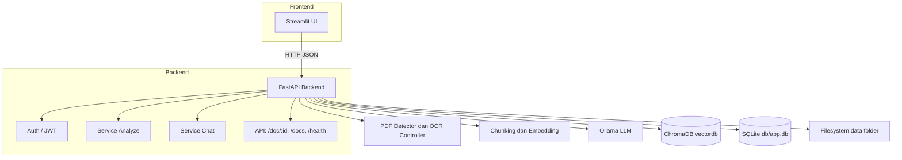
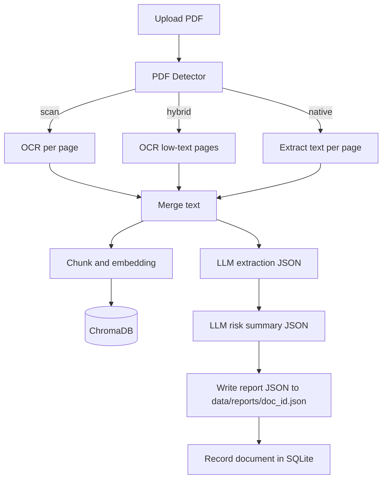
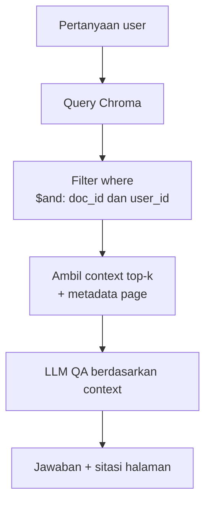
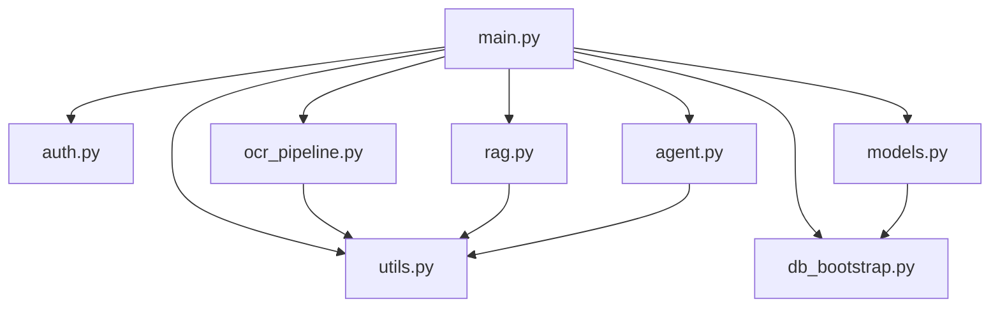
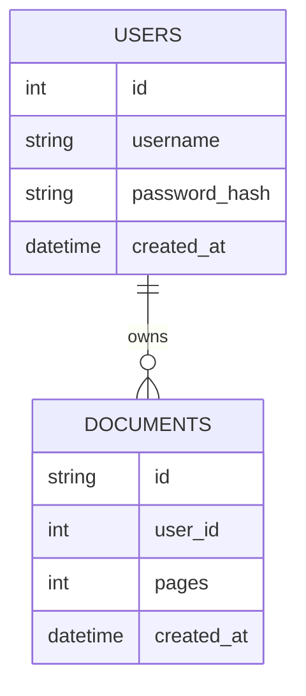

# Agentic Credit (Multi-User) — PDF Credit Analysis & QA

Aplikasi end-to-end untuk **analisis dokumen kredit** (PDF native/scan) dan **tanya-jawab berbasis isi dokumen**. Mendukung **multi-user** dengan isolasi dokumen, **OCR otomatis** (native vs scan vs hybrid), **RAG** menggunakan ChromaDB, dan **LLM** via Ollama (Llama 3.1).

## ✨ Fitur Utama

* **Upload & Analisis**: Ekstraksi entitas kredit, ringkasan risiko (JSON), dan rasio (DSCR, ICR, DER, dll).
* **Tanya-Jawab**: Mode chat RAG dengan sitasi halaman `(p.N)`.
* **Multi-User**: Login (JWT), dokumen & vektor **terisolasi per user**.
* **OCR Otomatis**: Deteksi **native/scan/hybrid** → hanya halaman yang perlu di-OCR.
* **Telemetry Off**: Posthog/Chroma dimatikan agar log bersih.

## 🧱 Teknis Singkat

* **Frontend**: Streamlit.
* **Backend**: FastAPI, SQLModel (SQLite), Pydantic.
* **OCR**: Tesseract + OpenCV + pdf2image + pypdf (deteksi native).
* **RAG**: ChromaDB + `all-MiniLM-L6-v2`.
* **LLM**: Ollama (default `llama3.1:8b-instruct-q8_0`).
* **Storage**:

  * `data/input/` PDF, `data/images/` halaman PNG, `data/ocr/` hasil teks, `data/reports/` JSON hasil analisis.
  * `vectordb/` Chroma, `db/app.db` SQLite.

---

# Arsitektur Sistem (Detail)

Aplikasi melakukan ekstraksi dan analisis dokumen kredit (PDF native / scan) serta tanya-jawab berbasis isi dokumen menggunakan RAG. Mendukung multi-user dengan isolasi data per user.

## 1) Topologi Sistem (Detail)



**Keterangan singkat**

* **Frontend**: login, upload PDF, melihat hasil ekstraksi & ringkasan, chat QA.
* **Backend**: orkestrasi pipeline (deteksi native/scan, OCR bila perlu, RAG, LLM).
* **Storage**:

  * `data/input` PDF, `data/images` halaman PNG untuk OCR, `data/ocr` teks, `data/reports` JSON hasil.
  * `vectordb` untuk Chroma.
  * `db/app.db` SQLite untuk user & metadata dokumen.

---

## 2) Pipeline Analyze (Upload → JSON hasil + indeks RAG)



**Catatan**

* Detector menilai kepadatan teks per halaman. Mode **hybrid** hanya OCR halaman yang perlu → lebih cepat.
* Metadata vektor di Chroma menyimpan `doc_id`, `user_id`, `page` untuk **isolasi per user** dan sitasi halaman saat QA.

---

## 3) Pipeline Chat (QA berbasis dokumen)



**Perilaku**

* Prompt QA memaksa jawaban **hanya** dari konteks. Jika tidak ditemukan → jawab “Tidak ditemukan di konteks”.
* Bila metadata halaman ada, model menyertakan sitasi `(p.N)`.

---

## 4) Interaksi Modul Backend



**Ringkasan fungsi**

* **main.py**: definisi endpoint, wiring modul, CORS, inisialisasi RagStore.
* **auth.py**: login, verifikasi JWT, dependency `get_current_user`.
* **ocr\_pipeline.py**: deteksi native/scan/hybrid, render halaman, preprocess OpenCV, OCR Tesseract.
* **rag.py**: Chroma PersistentClient, add\_pages (chunk per halaman), query dengan filter `(doc_id, user_id)`.
* **agent.py**: panggilan LLM (ekstraksi JSON, ringkasan risiko, QA), hitung rasio (DSCR, ICR, FCCR, Current, Quick, DER, EBITDA Margin).
* **models.py**: SQLModel untuk `users`, `documents`.
* **utils.py**: helper IO, sanitasi JSON, pembuatan direktori.
* **db\_bootstrap.py**: create\_all skema SQLite saat bootstrap.

---

## 5) Model Data & Isolasi



**Vector Store (ChromaDB)**

* **documents**: teks chunk (per halaman atau sub-halaman).
* **metadatas**: `doc_id`, `user_id`, `page`, `chunk_index`.
* **query**: selalu `where = {"$and":[{"doc_id": ...}, {"user_id": ...}]}` → user A tidak bisa membaca vektor user B.

**Filesystem**

* `data/input` → PDF,
* `data/images` → PNG halaman,
* `data/ocr` → hasil OCR,
* `data/reports` → 1 file JSON per dokumen: `json_struct`, `risk_summary`, dan ringkasan lain jika ada.

---

## 6) Kontrak API (Inti)

* `POST /auth/login` → `{ "access_token": "..." }`
* `POST /analyze` (multipart `file=PDF`) → `{ doc_id, pages, json_struct, risk_summary }`
* `POST /chat` `{ doc_id, question, history }` → `{ answer, sources }`
* `GET /docs` → daftar dokumen milik user saat ini
* `GET /doc/:id` → JSON hasil analisis tersimpan
* `GET /health` → `{ status: "ok" }`

Semua endpoint inti (kecuali `/health`) butuh header `Authorization: Bearer <token>`.

---

## 7) Konfigurasi Utama

* **Ollama**: `OLLAMA_MODEL`, `OLLAMA_HOST`, `OLLAMA_NUM_CTX`, `OLLAMA_NUM_THREAD`, `OLLAMA_NUM_PREDICT`, `OLLAMA_TEMPERATURE`.
* **Telemetry**: `ANONYMIZED_TELEMETRY=False`, `CHROMA_TELEMETRY_DISABLED=1`.
* **App**: `APP_HOST`, `APP_PORT`.
* **Frontend**: `frontend/.streamlit/secrets.toml` → `BACKEND_URL = "http://localhost:8000"`.

---

## 8) Alur Keamanan & Isolasi

* **Login** menghasilkan JWT, disimpan di session state Streamlit.
* **RAG** selalu disaring dengan `(doc_id, user_id)`.
* **/docs** menarik daftar dokumen dari SQLite berdasarkan `user_id`.
* **/doc/\:id** bisa diberi pemeriksaan kepemilikan (opsional → direkomendasikan aktif).

---

## 9) Performa & Skalabilitas

* Model default `llama3.1:8b-instruct-q8_0` (quantized) untuk latensi interaktif.
* OCR selektif (hybrid) menghemat waktu proses.
* Embedding `all-MiniLM-L6-v2` seimbang; bisa diganti ke E5-small bila butuh recall lebih tinggi.
* Pisah koleksi Chroma per lingkungan/tenant jika skala besar.
* Batasi paralelisme OCR/LLM sesuai CPU/GPU.

---

## 10) Titik Enhancement

* Ekstraksi tabel finansial untuk PDF teks (`pdfplumber` atau `camelot`) → isi `financials` lebih akurat.
* Validasi skema hasil JSON (pydantic) + versioning.
* Redaksi identitas sensitif (NPWP/NIK) saat simpan report.
* Multi-doc RAG dalam satu user (opsi pencarian lintas dokumen).

---

Kalau kamu mau, aku bisa tambah **diagram deployment** (WSL + GPU + service boundary) atau **sequence diagram rinci** untuk error handling.


---

## 🗂️ Struktur Folder

```
agentic-credit/
├─ backend/
│  ├─ main.py            # FastAPI server & routing
│  ├─ auth.py            # Login/JWT, session
│  ├─ models.py          # SQLModel: users, documents
│  ├─ db_bootstrap.py    # inisialisasi DB
│  ├─ ocr_pipeline.py    # detector native/scan + OCR auto
│  ├─ pdf_detect.py      # (opsional) deteksi PDF (pypdf)
│  ├─ rag.py             # Chroma retriever (isolasi user_id)
│  ├─ agent.py           # LLM calls: ekstraksi + risk + QA
│  ├─ prompts.py         # template prompts
│  └─ utils.py           # helper IO & JSON
├─ frontend/
│  └─ app.py             # Streamlit UI (login, analyze, chat)
├─ data/
│  ├─ input/             # PDF upload
│  ├─ images/            # gambar halaman untuk OCR
│  ├─ ocr/               # hasil teks OCR
│  └─ reports/           # JSON ekstraksi + risiko
├─ vectordb/             # ChromaDB
├─ db/                   # SQLite (app.db)
├─ requirements.txt
├─ .env
└─ install_agentic_credit.sh
```

---

## 🔐 Multi-User & Isolasi Data

* **Login**: `/auth/login` → JWT token.
* **Dokumen per user**: tabel `documents(user_id, id, pages, ...)`.
* **RAG terisolasi**: `metadatas={"doc_id":..., "user_id":...}` dan `where={"$and":[{"doc_id":...},{"user_id":...}]}` saat query ke Chroma → **user A tidak bisa melihat vektor milik user B**.
* **Cache hasil analisis**: `/doc/{doc_id}` membaca file `data/reports/{doc_id}.json` (opsional: verifikasi kepemilikan sebelum kirim).

---

## ⚙️ Konfigurasi ( `.env` )

```ini
# Ollama
OLLAMA_HOST=http://127.0.0.1:11434
OLLAMA_MODEL=llama3.1:8b-instruct-q8_0
OLLAMA_NUM_CTX=8192
OLLAMA_NUM_THREAD=8
OLLAMA_NUM_PREDICT=1024
OLLAMA_TEMPERATURE=0.2

# Chroma telemetry off
ANONYMIZED_TELEMETRY=False
CHROMA_TELEMETRY_DISABLED=1

# App
APP_HOST=0.0.0.0
APP_PORT=8000
```

---

## 🧠 Ekstraksi & Rasio (di `agent.py`)

* LLM dipaksa **JSON valid** (`options.format="json"`).
* Normalisasi istilah finansial ID/EN → kunci standar `financials`:
  `revenue, cogs, opex, ebit, ebitda, interest_expense, principal_due, current_assets, current_liabilities, inventory, total_debt, total_equity, capex, cfo`.
* Hitung rasio: **DSCR, ICR, FCCR, Current, Quick, DER, EBITDA Margin** (tahan null, fallback quick-assets = current\_assets − inventory).
* QA menyertakan **sitasi (p.N)** bila metadata halaman tersedia.

---

## 🚀 Menjalankan

### Installer (WSL/Ubuntu)

```bash
bash install_agentic_credit.sh
```

### Manual

```bash
# Backend
cd backend
source ../venv/bin/activate
uvicorn main:app --host 0.0.0.0 --port 8000 --reload

# Frontend
cd ../frontend
source ../venv/bin/activate
streamlit run app.py
```

---

## 🧪 Endpoint Ringkas

* `POST /auth/login` → {access\_token}
* `POST /analyze` (PDF) → {doc\_id, pages, json\_struct, risk\_summary}
* `POST /chat` {doc\_id, question, history} → {answer, sources}
* `GET /doc/{doc_id}` → report JSON (ekstraksi + risiko)
* `GET /health` → {status: ok}

---

## 🧰 Troubleshooting Cepat

* **Model not found**: ganti `OLLAMA_MODEL` ke model yang sudah ada (`ollama list`) atau `ollama pull`.
* **sqlite “unable to open database”**: pastikan folder `db/` ada & writeable.
* **Chroma telemetry warning**: sudah dimatikan via env.
* **Frontend dapat HTML**: sekarang semua request pakai `Accept: application/json`, plus fallback parser.

---

## 📈 Roadmap (opsional)

* Ekstraksi tabel finansial (pdfplumber/camelot) untuk angka yang lebih presisi.
* Validasi skema hasil JSON + versioning.
* Redaksi otomatis identitas sensitif (NPWP/NIK) sebelum simpan.
* Monitoring kinerja & antrian job OCR untuk dokumen besar.

---

