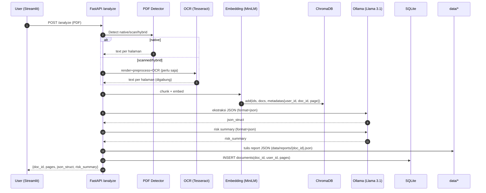
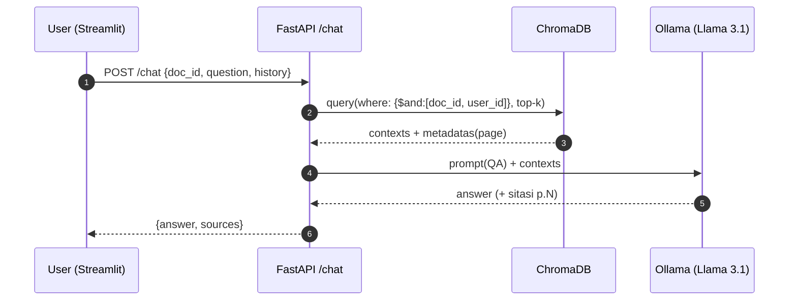

# Agentic Credit (Multi-User) — PDF Credit Analysis & QA

Aplikasi end-to-end untuk **analisis dokumen kredit** (PDF native/scan) dan **tanya-jawab berbasis isi dokumen**. Mendukung **multi-user** dengan isolasi dokumen, **OCR otomatis** (native vs scan vs hybrid), **RAG** menggunakan ChromaDB, dan **LLM** via Ollama (Llama 3.1).

## ✨ Fitur Utama

* **Upload & Analisis**: Ekstraksi entitas kredit, ringkasan risiko (JSON), dan rasio (DSCR, ICR, DER, dll).
* **Tanya-Jawab**: Mode chat RAG dengan sitasi halaman `(p.N)`.
* **Multi-User**: Login (JWT), dokumen & vektor **terisolasi per user**.
* **OCR Otomatis**: Deteksi **native/scan/hybrid** → hanya halaman yang perlu di-OCR.
* **Telemetry Off**: Posthog/Chroma dimatikan agar log bersih.

## 🧱 Teknis Singkat

* **Frontend**: Streamlit.
* **Backend**: FastAPI, SQLModel (SQLite), Pydantic.
* **OCR**: Tesseract + OpenCV + pdf2image + pypdf (deteksi native).
* **RAG**: ChromaDB + `all-MiniLM-L6-v2`.
* **LLM**: Ollama (default `llama3.1:8b-instruct-q8_0`).
* **Storage**:

  * `data/input/` PDF, `data/images/` halaman PNG, `data/ocr/` hasil teks, `data/reports/` JSON hasil analisis.
  * `vectordb/` Chroma, `db/app.db` SQLite.

---

## 🔭 Arsitektur Sistem

```mermaid
flowchart TD
A[Streamlit UI] -->|HTTP JSON| B[FastAPI Backend]

subgraph Frontend
A
end

subgraph Backend
B --> C[Auth JWT]
B --> D[Analyze]
B --> E[Chat]
B --> K[/doc/:id dan /health]
end

B --> F[OCR dan PDF Detector]
B --> G[Chunking dan Embedding]
B --> H[ChromaDB]
B --> I[Ollama LLM]
B --> J[Filesystem data/*]
B --> L[SQLite db/app.db]
```

---

## 🔁 Alur Kerja

### 1) Analyze (Upload → JSON)



### 2) Chat (Q\&A Berbasis Dokumen)



---

## 🗂️ Struktur Folder

```
agentic-credit/
├─ backend/
│  ├─ main.py            # FastAPI server & routing
│  ├─ auth.py            # Login/JWT, session
│  ├─ models.py          # SQLModel: users, documents
│  ├─ db_bootstrap.py    # inisialisasi DB
│  ├─ ocr_pipeline.py    # detector native/scan + OCR auto
│  ├─ pdf_detect.py      # (opsional) deteksi PDF (pypdf)
│  ├─ rag.py             # Chroma retriever (isolasi user_id)
│  ├─ agent.py           # LLM calls: ekstraksi + risk + QA
│  ├─ prompts.py         # template prompts
│  └─ utils.py           # helper IO & JSON
├─ frontend/
│  └─ app.py             # Streamlit UI (login, analyze, chat)
├─ data/
│  ├─ input/             # PDF upload
│  ├─ images/            # gambar halaman untuk OCR
│  ├─ ocr/               # hasil teks OCR
│  └─ reports/           # JSON ekstraksi + risiko
├─ vectordb/             # ChromaDB
├─ db/                   # SQLite (app.db)
├─ requirements.txt
├─ .env
└─ install_agentic_credit.sh
```

---

## 🔐 Multi-User & Isolasi Data

* **Login**: `/auth/login` → JWT token.
* **Dokumen per user**: tabel `documents(user_id, id, pages, ...)`.
* **RAG terisolasi**: `metadatas={"doc_id":..., "user_id":...}` dan `where={"$and":[{"doc_id":...},{"user_id":...}]}` saat query ke Chroma → **user A tidak bisa melihat vektor milik user B**.
* **Cache hasil analisis**: `/doc/{doc_id}` membaca file `data/reports/{doc_id}.json` (opsional: verifikasi kepemilikan sebelum kirim).

---

## ⚙️ Konfigurasi ( `.env` )

```ini
# Ollama
OLLAMA_HOST=http://127.0.0.1:11434
OLLAMA_MODEL=llama3.1:8b-instruct-q8_0
OLLAMA_NUM_CTX=8192
OLLAMA_NUM_THREAD=8
OLLAMA_NUM_PREDICT=1024
OLLAMA_TEMPERATURE=0.2

# Chroma telemetry off
ANONYMIZED_TELEMETRY=False
CHROMA_TELEMETRY_DISABLED=1

# App
APP_HOST=0.0.0.0
APP_PORT=8000
```

---

## 🧠 Ekstraksi & Rasio (di `agent.py`)

* LLM dipaksa **JSON valid** (`options.format="json"`).
* Normalisasi istilah finansial ID/EN → kunci standar `financials`:
  `revenue, cogs, opex, ebit, ebitda, interest_expense, principal_due, current_assets, current_liabilities, inventory, total_debt, total_equity, capex, cfo`.
* Hitung rasio: **DSCR, ICR, FCCR, Current, Quick, DER, EBITDA Margin** (tahan null, fallback quick-assets = current\_assets − inventory).
* QA menyertakan **sitasi (p.N)** bila metadata halaman tersedia.

---

## 🚀 Menjalankan

### Installer (WSL/Ubuntu)

```bash
bash install_agentic_credit.sh
```

### Manual

```bash
# Backend
cd backend
source ../venv/bin/activate
uvicorn main:app --host 0.0.0.0 --port 8000 --reload

# Frontend
cd ../frontend
source ../venv/bin/activate
streamlit run app.py
```

---

## 🧪 Endpoint Ringkas

* `POST /auth/login` → {access\_token}
* `POST /analyze` (PDF) → {doc\_id, pages, json\_struct, risk\_summary}
* `POST /chat` {doc\_id, question, history} → {answer, sources}
* `GET /doc/{doc_id}` → report JSON (ekstraksi + risiko)
* `GET /health` → {status: ok}

---

## 🧰 Troubleshooting Cepat

* **Model not found**: ganti `OLLAMA_MODEL` ke model yang sudah ada (`ollama list`) atau `ollama pull`.
* **sqlite “unable to open database”**: pastikan folder `db/` ada & writeable.
* **Chroma telemetry warning**: sudah dimatikan via env.
* **Frontend dapat HTML**: sekarang semua request pakai `Accept: application/json`, plus fallback parser.

---

## 📈 Roadmap (opsional)

* Ekstraksi tabel finansial (pdfplumber/camelot) untuk angka yang lebih presisi.
* Validasi skema hasil JSON + versioning.
* Redaksi otomatis identitas sensitif (NPWP/NIK) sebelum simpan.
* Monitoring kinerja & antrian job OCR untuk dokumen besar.

---

