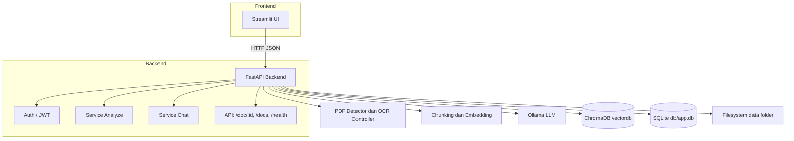
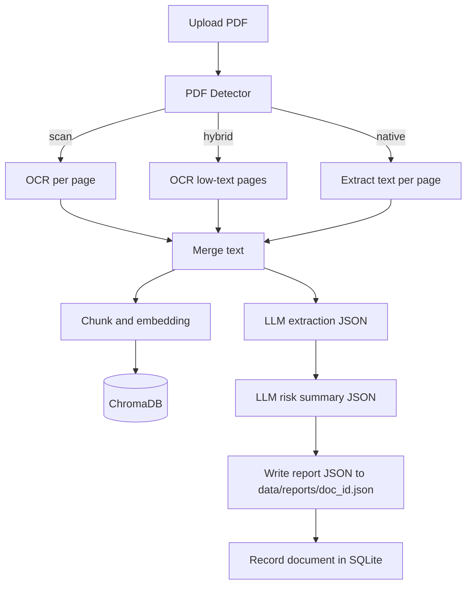
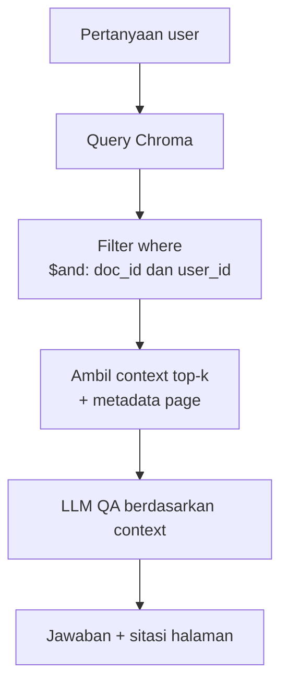
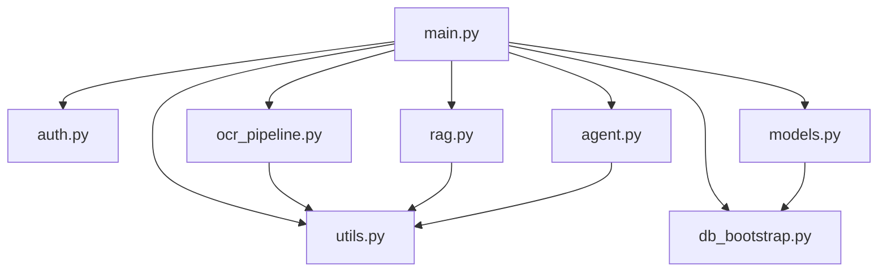
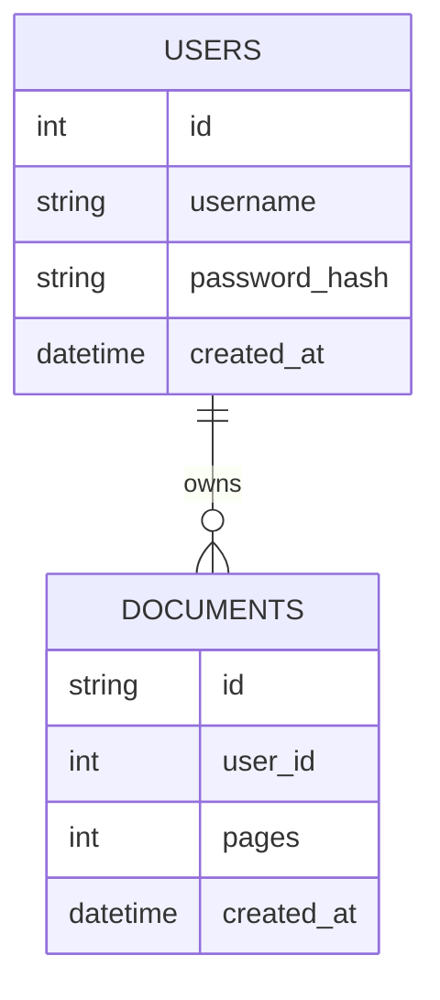
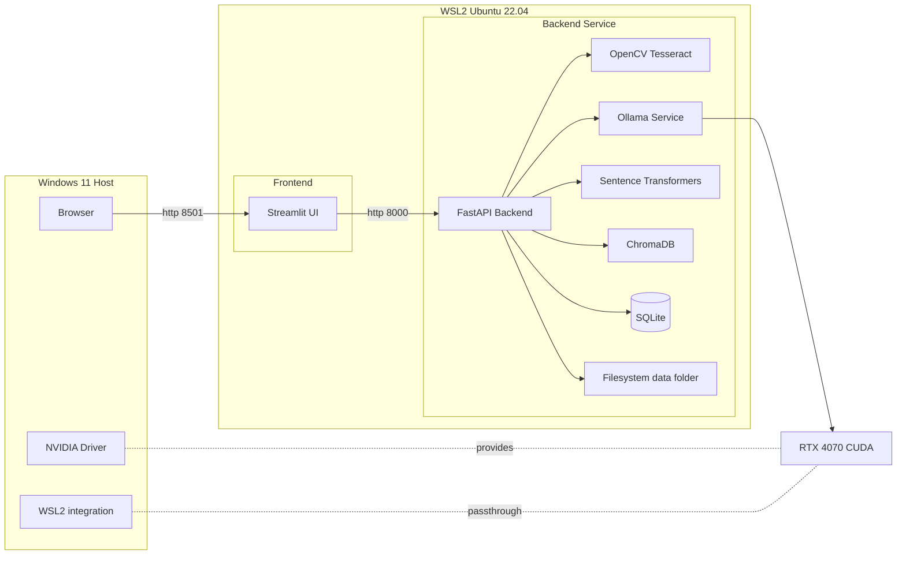
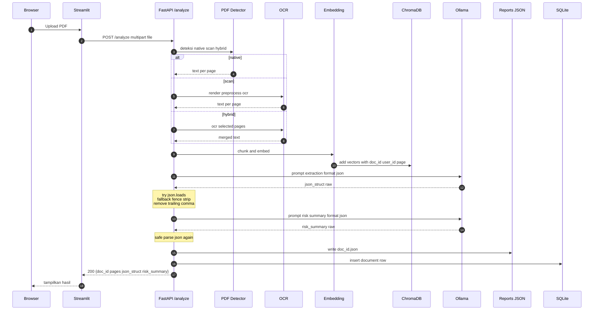
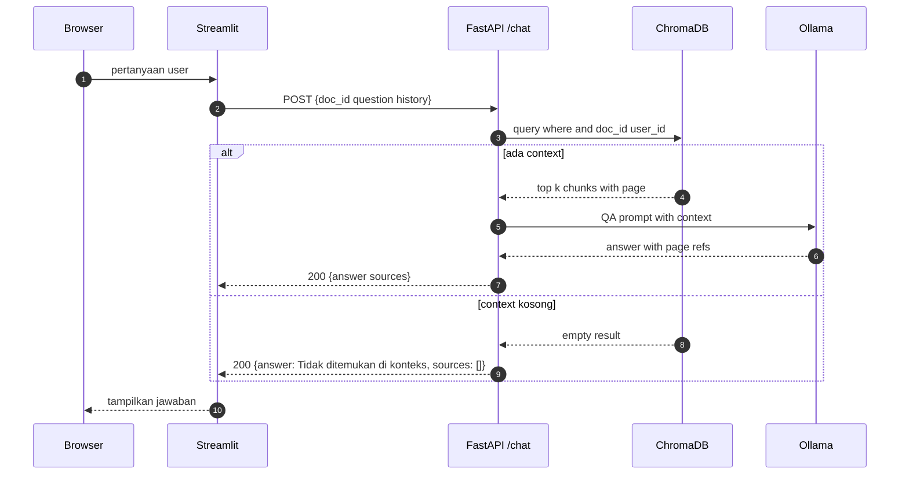

# Agentic Credit (Multi-User) — PDF Credit Analysis & QA

Aplikasi end-to-end untuk **analisis dokumen kredit** (PDF native/scan) dan **tanya-jawab berbasis isi dokumen**. Mendukung **multi-user** dengan isolasi dokumen, **OCR otomatis** (native vs scan vs hybrid), **RAG** menggunakan ChromaDB, dan **LLM** via Ollama (Llama 3.1).
Mantap—kamu tepat: “tenaga” utama alat ini ada di **LLM** dan **RAG**. Di bawah ini penjelasan end-to-end: cara kerja, komponen penting, tuning praktis, plus perbedaan dengan machine learning (ML) klasik.

---

# 1) LLM di aplikasi ini (peran, alur, dan kontrol)

## Apa yang dikerjakan LLM?

1. **Ekstraksi terstruktur** dari teks dokumen kredit → output JSON (bidang seperti debtor, fasilitas, bunga, tenor, dll).
2. **Ringkasan risiko** → skor, faktor risiko, rekomendasi, dan (di kode kamu) menghitung rasio finansial turunan (DSCR, ICR, FCCR, Current/Quick Ratio, DER, EBITDA Margin) dari bagian `financials` bila tersedia.
3. **Tanya-jawab (QA)** → jawaban ringkas **berdasarkan konteks** yang diambil oleh RAG; kalau konteks tidak ada, jawab “Tidak ditemukan di konteks”.

## Bagaimana LLM dipanggil?

* Via **Ollama** (lokal), model default: `llama3.1:8b-instruct-q8_0` (quantized, cepat).
* Konfigurasi di `.env`:

  * `OLLAMA_MODEL`, `OLLAMA_NUM_CTX` (panjang konteks), `OLLAMA_NUM_PREDICT` (maks token keluaran), `OLLAMA_TEMPERATURE` (kreativitas), `OLLAMA_NUM_THREAD` (CPU threads).
* Ekstraksi & ringkasan memakai opsi `format=json` agar balasan lebih disiplin JSON (di `agent.py` versi terbaru sudah di-set).

## Alur LLM (high level)

1. **Ekstraksi**: prompt sistem menetapkan peran “asisten ekstraksi”; prompt pengguna memberi instruksi *“Kembalikan HANYA JSON valid”* + potongan teks dokumen.
2. **Ringkasan risiko**: prompt kedua meringkas ke JSON berisi skor & faktor; kode menambahkan **`computed_ratios`** hasil hitungan deterministik dari angka di `financials`.
3. **QA**: prompt sistem “jawab hanya dari konteks”; aplikasi mengirimkan top-k potongan konteks (hasil RAG) + riwayat chat singkat; LLM mengembalikan jawaban, idealnya menyertakan **(p.N)** jika metadata halaman ada.

## Kekuatan LLM di sini

* **Fleksibel** terhadap variasi format dokumen (surat, lampiran, memo, dll).
* **Bilingual** ID/EN.
* **Struktur JSON** yang bisa langsung dipakai (disiplin lewat `format=json` + sanitizer fallback).

## Keterbatasan & mitigasi

* **Hallucination**: dijinakkan dengan:

  * QA selalu diberi konteks RAG; instruksi “kalau tak ada di konteks, bilang tidak ada”.
  * Temperatur rendah (`0.2`) agar output stabil.
  * Ekstraksi & ringkasan memaksa **JSON**; ada parser aman (strip code fence, hapus trailing comma).
* **Kualitas OCR** mempengaruhi hasil → perkuat preprocessing, gunakan mode hybrid (hanya OCR halaman yang perlu), dan (opsional) tambahkan pembersih teks pasca OCR.

---

# 2) RAG (Retrieval-Augmented Generation): arsitektur & cara kerja

## Inti RAG di proyek ini

* **Vector store**: **ChromaDB** (persistent).
* **Embedding**: `sentence-transformers/all-MiniLM-L6-v2` (ringan, umum, dimensi 384).
* **Chunking**: potong teks jadi potongan pendek agar “pas” untuk pencarian & konteks LLM. Di kodenya:

  * Variasi: chunk berbasis kata (default `chunk_size=800` kata dengan `overlap=80`) atau **per halaman** (melalui `add_pages` dengan metadata `page`).
* **Isolasi**: setiap embedding disimpan dengan metadata `doc_id` dan `user_id`. Semua query **selalu** memakai filter:

  * `where = {"$and": [{"doc_id": <doc>}, {"user_id": <user>}]}`
    → sehingga dokumen user A **tak pernah** muncul di user B.

## Alur RAG saat QA

1. User bertanya → backend panggil **Chroma** dengan **query\_text** pertanyaan, filter `(doc_id, user_id)`, dan `n_results = top_k`.
2. Ambil **top-k** potongan dengan skor tertinggi (semakin dekat hasil embedding).
3. Backend merangkai potongan (dan, bila ada, label halaman `(p.N)`) → feed ke LLM bersama instruksi QA.
4. LLM menjawab singkat, dengan sitasi halaman.

## Kenapa RAG penting?

* **Mengurangi hallucination**: jawaban dibatasi ke konten dokumen.
* **Privasi**: retrieval berdasarkan `(doc_id, user_id)` menjaga batas dokumen tiap user.
* **Tangguh terhadap variasi**: tanpa perlu fine-tune model, cukup masukkan konteks yang tepat.

## Parameter RAG yang krusial (bisa kamu “tuning”)

* **Chunk size & overlap**: besar potongannya. Kecil → lebih presisi tapi bisa putus konteks; besar → konteks utuh tapi bisa “bising”.
* **Top-k**: jumlah potongan yang diambil. Umumnya 4–8 cukup; terlalu banyak bikin LLM over-loaded.
* **Embedding model**: MiniLM-L6-v2 cepat; bila butuh recall lebih tinggi, pertimbangkan **E5-small** atau “domain-tuned” model (kompromi performa).
* **Re-ranking** (opsional, belum ada di kode): setelah top-k embedding, pakai cross-encoder untuk menilai ulang (naikkan presisi konteks).

---

# 3) LLM + RAG: hubungan & best-practice

* **LLM tanpa RAG**: model menebak sendiri dari “pengetahuan parametris” → berisiko salah/halu untuk detail dokumen spesifik.
* **LLM + RAG**: model fokus pada **konteks** yang relevan dari dokumen → jawaban lebih akurat, auditable (ada potongan sumber).
* **Ekstraksi**: meskipun bisa dilakukan via LLM langsung, kualitas input sangat berpengaruh (OCR, deteksi tabel). Tambahan modul ekstraksi tabel (pdfplumber/camelot untuk PDF native) dapat sangat meningkatkan akurasi angka.
* **QA**: gunakan prompt yang tegas, temperatur rendah, dan batasi panjang konteks (pakai `num_ctx` proporsional).

---

# 4) Perbedaan dengan Machine Learning (ML) “klasik”

| Aspek                          | LLM + RAG                                        | ML Klasik (Supervised / Feature-based)                              |
| ------------------------------ | ------------------------------------------------ | ------------------------------------------------------------------- |
| **Input**                      | Teks bebas (OCR/native) + retrieval konteks      | Fitur terstruktur (angka, kategori)                                 |
| **Data label**                 | Tidak wajib (pakai model foundation pre-trained) | Wajib label untuk setiap task (training)                            |
| **Hasil**                      | Bahasa alami + JSON ekstraksi; fleksibel format  | Prediksi numerik/kategori (skor, kelas)                             |
| **Adaptasi domain**            | Prompt engineering + RAG (tanpa retraining)      | Perlu retraining/fine-tuning jika domain berubah                    |
| **Kinerja pada teks variatif** | Kuat (NLU siap pakai)                            | Lemah tanpa heavy NLP pipeline                                      |
| **Determinisme**               | Stokastik (dikontrol dgn temperatur)             | Lebih deterministik bila fiturnya jelas                             |
| **Auditabilitas**              | RAG memberi potongan sumber (lebih auditable)    | Audit ke fitur & koefisien, tapi tidak langsung ke “kalimat sumber” |
| **Biaya awal**                 | Relatif rendah (tak perlu labeling)              | Lebih tinggi (kumpulkan & label data)                               |
| **Skalabilitas**               | Perlu atur konteks, top-k, latensi model         | Training sekali, inferensi cepat di task sempit                     |
| **Kapan cocok**                | Dokumen tak terstruktur, QA, ekstraksi teks      | Scoring numerik, prediksi tabular, model kredit statistikal         |

**Kapan memakai ML klasik di sistem ini?**

* Untuk **risk scoring** berbasis rasio finansial historis, **PD/LGD/EAD** modeling, atau **early warning** berbasis data tabular → ML klasik (logit, tree/boosting) sering lebih presisi, mudah dipantau, dan explainable untuk regulator.
* Aplikasi saat ini sudah menghitung rasio; jika nanti ada dataset label (default vs no-default), kamu bisa *tambahkan* model ML klasikal untuk skor risiko, sementara LLM tetap dipakai untuk **ekstraksi** & **QA**.

---

# 5) Bagaimana “menyetel” (tuning) agar hasil makin relevan

**LLM**

* Turunkan `TEMPERATURE` (mis. 0.1–0.3) untuk jawaban konsisten.
* Batasi `NUM_PREDICT` agar jawab ringkas, koheren.
* Perkaya prompt domain: definisi istilah perbankan, format angka Rupiah, tanggal, dll.
* Untuk ekstraksi, tetap pakai `options={"format":"json"}` dan sanitasi hasil.

**RAG**

* Sesuaikan `chunk_size` dan `overlap` (contoh awal 600–900 kata, overlap 10–15%).
* `top_k` 4–8; uji 5 vs 8 untuk melihat trade-off presisi vs kelengkapan.
* Pertimbangkan **re-ranking** tambahan (jika presisi pengambilan konteks masih kurang).
* Isi metadata halaman (`page`) agar QA bisa menyertakan **(p.N)**.

**OCR & Tabel**

* Pakai mode **hybrid** deteksi halaman → OCR hanya halaman “kosong teks”.
* Tambahkan ekstraksi tabel **native** (pdfplumber/camelot) → angka lebih bersih masuk ke `financials` (LLM tak perlu menebak).

---

## Ringkasnya

* **LLM** memberi kecerdasan bahasa (ekstraksi, ringkasan, QA) tanpa perlu training dataset, cocok untuk dokumen tak terstruktur.
* **RAG** memastikan jawaban **berdasarkan isi dokumen** milik user yang benar (terisolasi), sehingga akurat & auditable.
* **ML klasik** tetap relevan untuk skor/klasifikasi berbasis data tabular (regulator-friendly, deterministik), dan bisa **melengkapi** LLM+RAG (bukan menggantikan).

Kalau kamu mau, aku bisa bantu:

* Menambahkan **re-ranking** di RAG,
* Modul ekstraksi **tabel finansial** untuk PDF native,
* atau menyiapkan **pipeline ML** kecil untuk risk scoring dari rasio hasil ekstraksi.

## ✨ Fitur Utama

* **Upload & Analisis**: Ekstraksi entitas kredit, ringkasan risiko (JSON), dan rasio (DSCR, ICR, DER, dll).
* **Tanya-Jawab**: Mode chat RAG dengan sitasi halaman `(p.N)`.
* **Multi-User**: Login (JWT), dokumen & vektor **terisolasi per user**.
* **OCR Otomatis**: Deteksi **native/scan/hybrid** → hanya halaman yang perlu di-OCR.
* **Telemetry Off**: Posthog/Chroma dimatikan agar log bersih.

## 🧱 Teknis Singkat

* **Frontend**: Streamlit.
* **Backend**: FastAPI, SQLModel (SQLite), Pydantic.
* **OCR**: Tesseract + OpenCV + pdf2image + pypdf (deteksi native).
* **RAG**: ChromaDB + `all-MiniLM-L6-v2`.
* **LLM**: Ollama (default `llama3.1:8b-instruct-q8_0`).
* **Storage**:

  * `data/input/` PDF, `data/images/` halaman PNG, `data/ocr/` hasil teks, `data/reports/` JSON hasil analisis.
  * `vectordb/` Chroma, `db/app.db` SQLite.

---

# Arsitektur Sistem (Detail)

Aplikasi melakukan ekstraksi dan analisis dokumen kredit (PDF native / scan) serta tanya-jawab berbasis isi dokumen menggunakan RAG. Mendukung multi-user dengan isolasi data per user.

## 1) Topologi Sistem (Detail)



**Keterangan singkat**

* **Frontend**: login, upload PDF, melihat hasil ekstraksi & ringkasan, chat QA.
* **Backend**: orkestrasi pipeline (deteksi native/scan, OCR bila perlu, RAG, LLM).
* **Storage**:

  * `data/input` PDF, `data/images` halaman PNG untuk OCR, `data/ocr` teks, `data/reports` JSON hasil.
  * `vectordb` untuk Chroma.
  * `db/app.db` SQLite untuk user & metadata dokumen.

---

## 2) Pipeline Analyze (Upload → JSON hasil + indeks RAG)



**Catatan**

* Detector menilai kepadatan teks per halaman. Mode **hybrid** hanya OCR halaman yang perlu → lebih cepat.
* Metadata vektor di Chroma menyimpan `doc_id`, `user_id`, `page` untuk **isolasi per user** dan sitasi halaman saat QA.

---

## 3) Pipeline Chat (QA berbasis dokumen)



**Perilaku**

* Prompt QA memaksa jawaban **hanya** dari konteks. Jika tidak ditemukan → jawab “Tidak ditemukan di konteks”.
* Bila metadata halaman ada, model menyertakan sitasi `(p.N)`.

---

## 4) Interaksi Modul Backend



**Ringkasan fungsi**

* **main.py**: definisi endpoint, wiring modul, CORS, inisialisasi RagStore.
* **auth.py**: login, verifikasi JWT, dependency `get_current_user`.
* **ocr\_pipeline.py**: deteksi native/scan/hybrid, render halaman, preprocess OpenCV, OCR Tesseract.
* **rag.py**: Chroma PersistentClient, add\_pages (chunk per halaman), query dengan filter `(doc_id, user_id)`.
* **agent.py**: panggilan LLM (ekstraksi JSON, ringkasan risiko, QA), hitung rasio (DSCR, ICR, FCCR, Current, Quick, DER, EBITDA Margin).
* **models.py**: SQLModel untuk `users`, `documents`.
* **utils.py**: helper IO, sanitasi JSON, pembuatan direktori.
* **db\_bootstrap.py**: create\_all skema SQLite saat bootstrap.

---

## 5) Model Data & Isolasi



**Vector Store (ChromaDB)**

* **documents**: teks chunk (per halaman atau sub-halaman).
* **metadatas**: `doc_id`, `user_id`, `page`, `chunk_index`.
* **query**: selalu `where = {"$and":[{"doc_id": ...}, {"user_id": ...}]}` → user A tidak bisa membaca vektor user B.

**Filesystem**

* `data/input` → PDF,
* `data/images` → PNG halaman,
* `data/ocr` → hasil OCR,
* `data/reports` → 1 file JSON per dokumen: `json_struct`, `risk_summary`, dan ringkasan lain jika ada.

---

## 6) Kontrak API (Inti)

* `POST /auth/login` → `{ "access_token": "..." }`
* `POST /analyze` (multipart `file=PDF`) → `{ doc_id, pages, json_struct, risk_summary }`
* `POST /chat` `{ doc_id, question, history }` → `{ answer, sources }`
* `GET /docs` → daftar dokumen milik user saat ini
* `GET /doc/:id` → JSON hasil analisis tersimpan
* `GET /health` → `{ status: "ok" }`

Semua endpoint inti (kecuali `/health`) butuh header `Authorization: Bearer <token>`.

---

## 7) Konfigurasi Utama

* **Ollama**: `OLLAMA_MODEL`, `OLLAMA_HOST`, `OLLAMA_NUM_CTX`, `OLLAMA_NUM_THREAD`, `OLLAMA_NUM_PREDICT`, `OLLAMA_TEMPERATURE`.
* **Telemetry**: `ANONYMIZED_TELEMETRY=False`, `CHROMA_TELEMETRY_DISABLED=1`.
* **App**: `APP_HOST`, `APP_PORT`.
* **Frontend**: `frontend/.streamlit/secrets.toml` → `BACKEND_URL = "http://localhost:8000"`.

---

## 8) Alur Keamanan & Isolasi

* **Login** menghasilkan JWT, disimpan di session state Streamlit.
* **RAG** selalu disaring dengan `(doc_id, user_id)`.
* **/docs** menarik daftar dokumen dari SQLite berdasarkan `user_id`.
* **/doc/\:id** bisa diberi pemeriksaan kepemilikan (opsional → direkomendasikan aktif).

---

## 9) Performa & Skalabilitas

* Model default `llama3.1:8b-instruct-q8_0` (quantized) untuk latensi interaktif.
* OCR selektif (hybrid) menghemat waktu proses.
* Embedding `all-MiniLM-L6-v2` seimbang; bisa diganti ke E5-small bila butuh recall lebih tinggi.
* Pisah koleksi Chroma per lingkungan/tenant jika skala besar.
* Batasi paralelisme OCR/LLM sesuai CPU/GPU.

---

## 10) Titik Enhancement

* Ekstraksi tabel finansial untuk PDF teks (`pdfplumber` atau `camelot`) → isi `financials` lebih akurat.
* Validasi skema hasil JSON (pydantic) + versioning.
* Redaksi identitas sensitif (NPWP/NIK) saat simpan report.
* Multi-doc RAG dalam satu user (opsi pencarian lintas dokumen).

---

mantap—aku tambahkan **diagram deployment (WSL + GPU + service boundary)** dan **sequence diagram rinci untuk error handling**. Semua sudah “GitHub-safe” (tanpa `\n` di label, tanpa `<br/>`, tiap edge satu baris). Tinggal copas ke README.md.

---

## 🔧 Deployment (WSL + GPU + Service Boundary)



**Keterangan singkat**

* Browser di Windows mengakses Streamlit di WSL: `http://localhost:8501`.
* Streamlit memanggil FastAPI: `http://localhost:8000`.
* FastAPI memanggil: OCR, Embedding, ChromaDB, Ollama, SQLite, dan menulis ke filesystem.
* GPU dipakai oleh Ollama (dan Torch bila digunakan oleh embedding model yang mendukung GPU).

---

## 🔁 Sequence: Analyze dengan Error Handling



**Strategi penanganan error**

* **LLM bukan JSON murni** → parser aman: strip code fence, normalisasi kecil, `json.loads` retry.
* **OCR gagal halaman tertentu** → lanjutkan halaman lain, beri flag di `risk_flags`.
* **Chroma telemetry error** → telemetry dimatikan via env, tidak blokir proses.
* **I/O JSON** → selalu `ensure_ascii=False` dan `indent=2`, directory ensured.

---

## 💬 Sequence: Chat dengan Error Handling



**Strategi penanganan error**

* **Context kosong** → jawaban default “Tidak ditemukan di konteks”.
* **Timeout LLM** → kembalikan 504 atau pesan error terstruktur di frontend.
* **JSON response non-parsable di frontend** → helper `fetch_json` fallback parsing dan error preview.

---

Kalau kamu mau, aku juga bisa tambahkan **diagram deployment fisik** (memisah host Windows, WSL, dan jaringan), atau **diagram sequence untuk alur login dan pengelolaan dokumen**.

---

## 🗂️ Struktur Folder

```
agentic-credit/
├─ backend/
│  ├─ main.py            # FastAPI server & routing
│  ├─ auth.py            # Login/JWT, session
│  ├─ models.py          # SQLModel: users, documents
│  ├─ db_bootstrap.py    # inisialisasi DB
│  ├─ ocr_pipeline.py    # detector native/scan + OCR auto
│  ├─ pdf_detect.py      # (opsional) deteksi PDF (pypdf)
│  ├─ rag.py             # Chroma retriever (isolasi user_id)
│  ├─ agent.py           # LLM calls: ekstraksi + risk + QA
│  ├─ prompts.py         # template prompts
│  └─ utils.py           # helper IO & JSON
├─ frontend/
│  └─ app.py             # Streamlit UI (login, analyze, chat)
├─ data/
│  ├─ input/             # PDF upload
│  ├─ images/            # gambar halaman untuk OCR
│  ├─ ocr/               # hasil teks OCR
│  └─ reports/           # JSON ekstraksi + risiko
├─ vectordb/             # ChromaDB
├─ db/                   # SQLite (app.db)
├─ requirements.txt
├─ .env
└─ install_agentic_credit.sh
```

---

## 🔐 Multi-User & Isolasi Data

* **Login**: `/auth/login` → JWT token.
* **Dokumen per user**: tabel `documents(user_id, id, pages, ...)`.
* **RAG terisolasi**: `metadatas={"doc_id":..., "user_id":...}` dan `where={"$and":[{"doc_id":...},{"user_id":...}]}` saat query ke Chroma → **user A tidak bisa melihat vektor milik user B**.
* **Cache hasil analisis**: `/doc/{doc_id}` membaca file `data/reports/{doc_id}.json` (opsional: verifikasi kepemilikan sebelum kirim).

---

## ⚙️ Konfigurasi ( `.env` )

```ini
# Ollama
OLLAMA_HOST=http://127.0.0.1:11434
OLLAMA_MODEL=llama3.1:8b-instruct-q8_0
OLLAMA_NUM_CTX=8192
OLLAMA_NUM_THREAD=8
OLLAMA_NUM_PREDICT=1024
OLLAMA_TEMPERATURE=0.2

# Chroma telemetry off
ANONYMIZED_TELEMETRY=False
CHROMA_TELEMETRY_DISABLED=1

# App
APP_HOST=0.0.0.0
APP_PORT=8000
```

---

## 🧠 Ekstraksi & Rasio (di `agent.py`)

* LLM dipaksa **JSON valid** (`options.format="json"`).
* Normalisasi istilah finansial ID/EN → kunci standar `financials`:
  `revenue, cogs, opex, ebit, ebitda, interest_expense, principal_due, current_assets, current_liabilities, inventory, total_debt, total_equity, capex, cfo`.
* Hitung rasio: **DSCR, ICR, FCCR, Current, Quick, DER, EBITDA Margin** (tahan null, fallback quick-assets = current\_assets − inventory).
* QA menyertakan **sitasi (p.N)** bila metadata halaman tersedia.

---

## 🚀 Menjalankan

### Installer (WSL/Ubuntu)

```bash
bash install_agentic_credit.sh
```

### Manual

```bash
# Backend
cd backend
source ../venv/bin/activate
uvicorn main:app --host 0.0.0.0 --port 8000 --reload

# Frontend
cd ../frontend
source ../venv/bin/activate
streamlit run app.py
```

---

## 🧪 Endpoint Ringkas

* `POST /auth/login` → {access\_token}
* `POST /analyze` (PDF) → {doc\_id, pages, json\_struct, risk\_summary}
* `POST /chat` {doc\_id, question, history} → {answer, sources}
* `GET /doc/{doc_id}` → report JSON (ekstraksi + risiko)
* `GET /health` → {status: ok}

---

## 🧰 Troubleshooting Cepat

* **Model not found**: ganti `OLLAMA_MODEL` ke model yang sudah ada (`ollama list`) atau `ollama pull`.
* **sqlite “unable to open database”**: pastikan folder `db/` ada & writeable.
* **Chroma telemetry warning**: sudah dimatikan via env.
* **Frontend dapat HTML**: sekarang semua request pakai `Accept: application/json`, plus fallback parser.

---

## 📈 Roadmap (opsional)

* Ekstraksi tabel finansial (pdfplumber/camelot) untuk angka yang lebih presisi.
* Validasi skema hasil JSON + versioning.
* Redaksi otomatis identitas sensitif (NPWP/NIK) sebelum simpan.
* Monitoring kinerja & antrian job OCR untuk dokumen besar.

---

